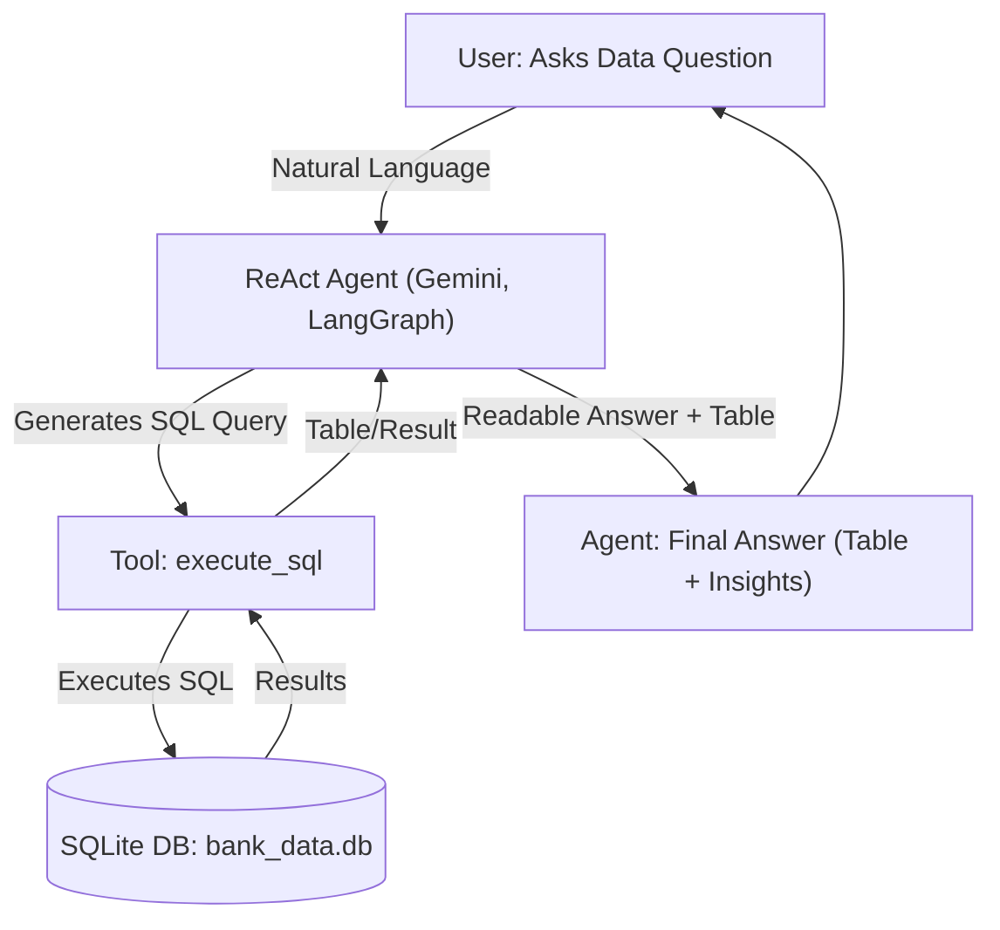
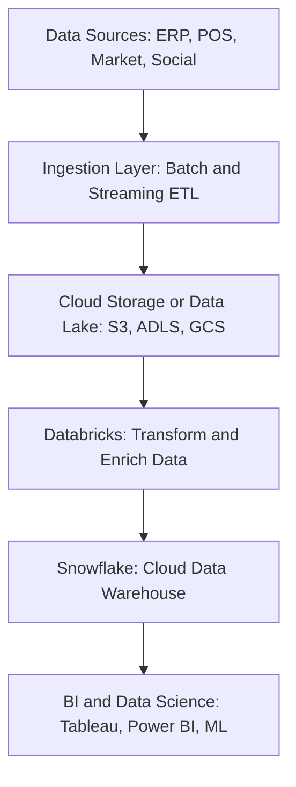

# Customer Data ReAct Agent

A conversational AI agent for natural language SQL analytics on bank customer data, powered by Gemini (Google Generative AI) and LangGraph's ReAct agent framework.

## Features

- Ask **natural language questions** about customer data (e.g., "Top 5 customers by balance", "Average balance by region").
- Agent **automatically translates** your question into a safe SQL query, runs it, and explains the result.
- Handles grouping, aggregation, filtering, and multi-factor analytics.
- Uses a single tool (`execute_sql`) for true agentic reasoning—no manual SQL needed!
- Robust to case sensitivity in text columns (thanks to prompt design).
- **Data source:** CSV (`customers.csv`) → SQLite (`bank_data.db`).

## Agent Architecture & Flow



## Quick Start

1. **Clone this repo and enter the directory:**
    ```sh
    git clone https://github.com/nishanttomar21/customer-data-sql-agent.git
    cd customer-data-sql-agent
    ```

2. **Install dependencies:**
    ```sh
    pip install -r requirements.txt
    ```

3. **Prepare your data:**
    - Place your `customers.csv` in the project root (headers must match those described in the script).

4. **Set your Gemini API key:**
    - In the script, replace `YOUR_GOOGLE_API_KEY` with your own [Google Generative AI](https://aistudio.google.com/app/apikey) API key.

5. **Run the agent:**
    ```sh
    python main.py
    ```

6. **Ask questions:**
    ```
    💬 Ask a data question: Top 5 customers by balance
    💬 Ask a data question: What is the average balance by region?
    ```

## Example Questions

- Show all customers.
- List customers from England.
- What is the average balance by gender, age group, and job classification?
- Which region has the highest number of "White Collar" customers?
- Who joined before 2018?
- Find the date joined for Ruth Campbell from Wales.

## Requirements

- Python 3.8+
- Google Generative AI API Key
- `customers.csv` in the correct schema

## Customization

- Edit the system prompt for more/less restrictive behavior or change analytics focus.
- Add new columns to `customers.csv` and update the prompt’s `<database_schema>` accordingly.

## Bonus: Scalable Modern Data Platform Architecture

> **End-to-end data pipeline for handling large-scale, complex data**



## Credits

- [LangGraph](https://github.com/langchain-ai/langgraph)
- [Google Generative AI](https://ai.google.dev/)
- [LangChain](https://github.com/langchain-ai/langchain)

